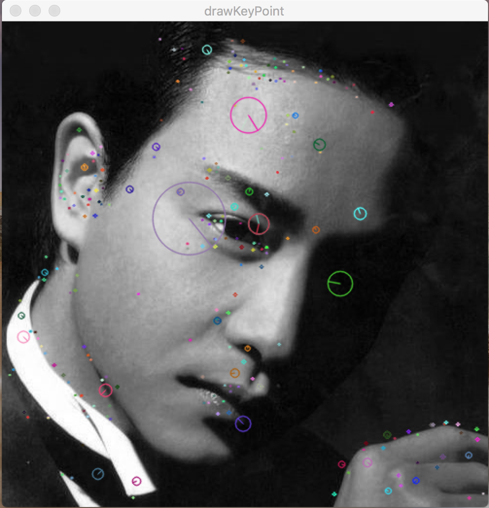
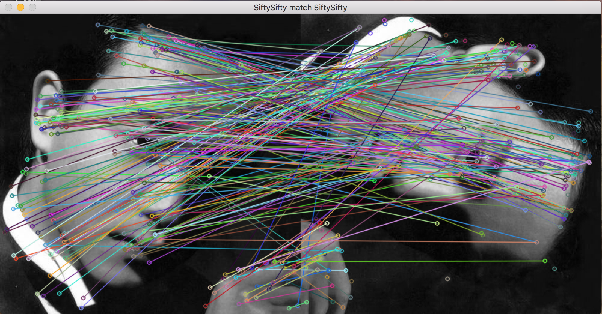
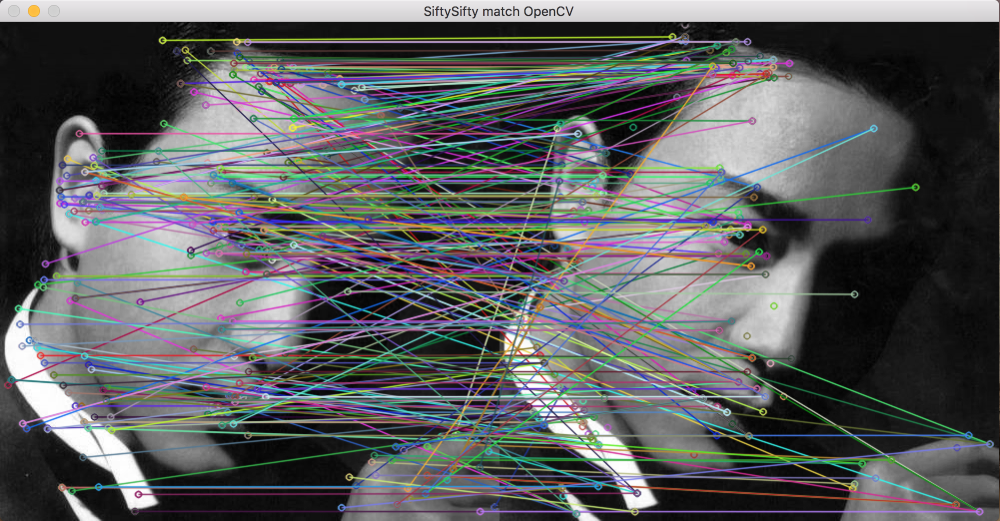

# SiftySifty
SiftySifty is a open source library that extract SIFT keypoins from a image. Writed by pure c++ and does't need any other library.

## Include
Only include extracting SIFT keypoints form a image, does't contains match and display. The SIFT algorithm ref:Lowe, D. Distinctive image features from scale-invariant keypoints. International Journal of Computer Vision, 60, 2 (2004), pp.91--110. Website:http://www.cs.ubc.ca/~lowe/keypoints/

## Demo 
Running The demo must need OpenCV. The demo includes display the keypoints on a image and match between with OpenCV.

### Display SIFT keypoints by SiftySifty
the keypoints that draws in the image is detected by SiftySifty and displayed by OepnCV.

 
 
### Math the images using SIFT keypoints by SiftySifty
the keypoints that draws in the image is detected by SiftySifty and matching&display is by OepnCV.

 
 
### Math the images using SIFT keypoints by SiftySifty and OpenCV
math keypoints between SiftySifty and OpenCV, left is SiftySifty, right is OpenCV. Displayed by OepnCV.

